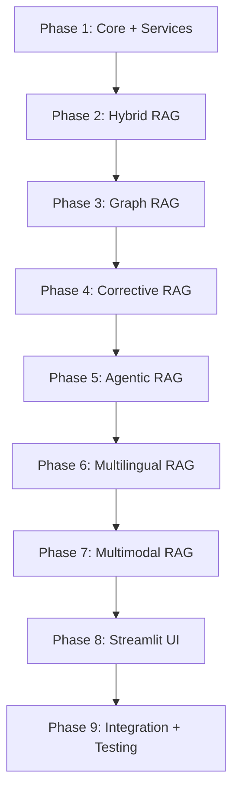

# Multiple RAG System — Implementation Plan

A unified Python system that implements **6 RAG architectures** in a single, modular application with a Streamlit UI. Users can upload documents, select a RAG architecture, and query their data — all from one interface.

## Reference Architectures

Based on the two reference images in the workspace:

| # | Architecture | Core Idea |
|---|-------------|-----------|
| 1 | **Hybrid RAG** | Dense vectors + sparse BM25, merged via Reciprocal Rank Fusion |
| 2 | **Graph RAG** | Knowledge graph with entity extraction, subgraph retrieval, community summaries |
| 3 | **Agentic RAG** | Planner agent routes queries to multiple tools, loops until confident |
| 4 | **Corrective RAG (CRAG)** | Evaluator grades retrieved docs; web search fallback; query rewriting |
| 5 | **Multimodal RAG** | Indexes text, images, and tables through shared multimodal embeddings |
| 6 | **Multilingual RAG** | Cross-lingual embedding space for language-agnostic retrieval |

---

## User Review Required

> [!IMPORTANT]
> **LLM Provider Choice**: The plan defaults to **Google Gemini** as the primary LLM (via `google-genai` SDK) with **Ollama** as a free local alternative. If you prefer **OpenAI GPT-4** or another provider, let me know.

> [!IMPORTANT]
> **API Keys Needed**: The system will need API keys for:
> - **Google Gemini API** (or OpenAI API) — for LLM generation + embeddings
> - **Tavily API** (optional) — for web search in Agentic/Corrective RAG (free tier: 1000 searches/month)
> - DuckDuckGo search is included as a **free fallback** requiring no API key.

> [!WARNING]
> **GPU Requirement for Multimodal RAG**: ColPali (the state-of-the-art approach) requires a GPU with ≥8GB VRAM. If you don't have a GPU, I'll implement a **fallback approach** using Gemini's vision API to caption images, then index captions as text. Both approaches will be supported.

> [!IMPORTANT]
> **Scope — MVP vs Full**: This plan is scoped as an **MVP** that is fully functional end-to-end for all 6 architectures. Production features (user auth, deployment, monitoring, Neo4j) can be added later. Each architecture will work with **PDF, TXT, and DOCX** files. Image support is added for Multimodal RAG.

---

## Open Questions

> [!IMPORTANT]
> 1. **Which LLM provider do you prefer?** Google Gemini (recommended, free tier available), OpenAI, or Ollama (fully local, free, but slower)?
> 2. **Do you have a GPU available?** This affects the Multimodal RAG approach (ColPali vs vision API captioning).
> 3. **Any specific document types** you plan to use beyond PDF/TXT/DOCX?
> 4. **Do you want the UI to compare architectures side-by-side?** (e.g., ask the same question to 2+ architectures and show results together)

---

## Technology Stack

| Layer | Choice | Rationale |
|-------|--------|-----------|
| **Language** | Python 3.11+ | Standard for ML/AI ecosystem |
| **RAG Framework** | LangChain + LangGraph | Best orchestration support, especially for Agentic and CRAG |
| **Vector Database** | ChromaDB | Zero-config, great for prototyping, persistent storage |
| **Knowledge Graph** | NetworkX | In-memory, pure Python, no external DB needed for MVP |
| **BM25 Search** | `rank_bm25` | Simple, reliable, well-documented |
| **Embeddings** | `sentence-transformers` (BAAI/bge-small-en-v1.5) | Free, local, high quality |
| **Multilingual Embeddings** | `sentence-transformers` (BAAI/bge-m3) | Best cross-lingual model |
| **LLM** | Google Gemini (primary) / Ollama (fallback) | Free tiers, flexible |
| **Web Search** | DuckDuckGo (free) + Tavily (optional) | No API key required for DDGS |
| **Document Parsing** | `PyPDF2`, `python-docx`, `Pillow` | Standard parsers |
| **Chunking** | LangChain `RecursiveCharacterTextSplitter` | Proven, configurable |
| **Frontend** | Streamlit | Rich widgets, chat UI, sidebar controls |
| **Config** | Pydantic + `.env` | Type-safe configuration |

---

## Project Structure

```
d:\Multiple RAG System\
├── app.py                          # Streamlit entry point
├── requirements.txt                # All dependencies
├── .env                            # API keys (gitignored)
├── config/
│   └── settings.py                 # Pydantic config models
├── core/
│   ├── __init__.py
│   ├── interfaces.py               # Abstract Base Classes
│   ├── schemas.py                  # Pydantic data models
│   └── registry.py                 # Architecture name → pipeline mapping
├── architectures/
│   ├── __init__.py
│   ├── hybrid/
│   │   ├── __init__.py
│   │   ├── retriever.py            # BM25 + Dense + RRF fusion
│   │   └── pipeline.py            # HybridRAGPipeline
│   ├── graph/
│   │   ├── __init__.py
│   │   ├── extractor.py           # LLM entity/relationship extraction
│   │   ├── graph_store.py         # NetworkX graph management
│   │   └── pipeline.py           # GraphRAGPipeline
│   ├── agentic/
│   │   ├── __init__.py
│   │   ├── agent.py              # LangGraph planner agent
│   │   ├── tools.py              # Vector search, web search, etc.
│   │   └── pipeline.py          # AgenticRAGPipeline
│   ├── corrective/
│   │   ├── __init__.py
│   │   ├── grader.py             # Document relevance evaluator
│   │   ├── rewriter.py           # Query rewriting logic
│   │   └── pipeline.py          # CorrectiveRAGPipeline
│   ├── multimodal/
│   │   ├── __init__.py
│   │   ├── processor.py          # Image/table processing
│   │   └── pipeline.py          # MultimodalRAGPipeline
│   └── multilingual/
│       ├── __init__.py
│       ├── embedder.py           # Cross-lingual BGE-M3 embeddings
│       └── pipeline.py          # MultilingualRAGPipeline
├── services/
│   ├── __init__.py
│   ├── vector_store.py           # ChromaDB adapter
│   ├── llm_provider.py           # Gemini/OpenAI/Ollama adapter
│   ├── embedding_service.py      # Embedding model adapter
│   ├── web_search.py             # DuckDuckGo/Tavily adapter
│   └── document_loader.py        # PDF/DOCX/TXT/Image loader + chunker
├── ui/
│   ├── __init__.py
│   ├── sidebar.py                # Architecture selector, settings, file upload
│   ├── chat.py                   # Chat interface component
│   └── visualizations.py         # Graph viewer, source display, architecture diagrams
├── data/
│   ├── uploads/                  # Raw uploaded files
│   ├── processed/                # Chunked data cache
│   └── graphs/                   # Serialized knowledge graphs
└── tests/
    ├── test_hybrid.py
    ├── test_graph.py
    └── test_services.py
```

---

## Proposed Changes

### Component 1: Core Framework

#### [NEW] [interfaces.py](file:///d:/Multiple RAG System/core/interfaces.py)
Abstract base classes that all architectures implement:
```python
class BasePipeline(ABC):
    async def ingest(self, documents: List[Document]) -> None: ...
    async def query(self, query: str) -> RAGResponse: ...
    def get_architecture_info(self) -> ArchitectureInfo: ...
```

#### [NEW] [schemas.py](file:///d:/Multiple RAG System/core/schemas.py)
Pydantic models shared across all architectures:
- `Document` — raw document with metadata (source, type, language)
- `Chunk` — text chunk with embedding, source reference
- `RAGResponse` — answer + sources + confidence + architecture used
- `RetrievalResult` — retrieved chunk + relevance score

#### [NEW] [registry.py](file:///d:/Multiple RAG System/core/registry.py)
Maps architecture names to pipeline classes. Switching architecture = one config change:
```python
REGISTRY = {
    "hybrid": HybridRAGPipeline,
    "graph": GraphRAGPipeline,
    "agentic": AgenticRAGPipeline,
    "corrective": CorrectiveRAGPipeline,
    "multimodal": MultimodalRAGPipeline,
    "multilingual": MultilingualRAGPipeline,
}
```

---

### Component 2: Shared Services

#### [NEW] [llm_provider.py](file:///d:/Multiple RAG System/services/llm_provider.py)
Adapter supporting multiple LLM backends:
- **Google Gemini** — via `google-genai` SDK (primary)
- **OpenAI** — via `openai` SDK
- **Ollama** — via HTTP API (local, free)
- Common interface: `generate(prompt, context) → str`

#### [NEW] [embedding_service.py](file:///d:/Multiple RAG System/services/embedding_service.py)
- Default: `all-MiniLM-L6-v2` (fast, English)
- Multilingual: `BAAI/bge-m3` (loaded only when multilingual RAG is selected)
- Common interface: `embed(texts) → List[List[float]]`

#### [NEW] [vector_store.py](file:///d:/Multiple RAG System/services/vector_store.py)
ChromaDB wrapper with:
- Collection management per architecture
- Add, query, delete operations
- Metadata filtering

#### [NEW] [document_loader.py](file:///d:/Multiple RAG System/services/document_loader.py)
- PDF parsing via `PyPDF2`
- DOCX parsing via `python-docx`
- TXT reading
- Image handling via `Pillow` (for multimodal)
- Chunking via `RecursiveCharacterTextSplitter` (default: 1000 chars, 200 overlap)

#### [NEW] [web_search.py](file:///d:/Multiple RAG System/services/web_search.py)
- DuckDuckGo search (free, no API key)
- Tavily search (optional, higher quality)
- Common interface: `search(query, max_results) → List[SearchResult]`

---

### Component 3: Hybrid RAG Architecture

#### [NEW] [retriever.py](file:///d:/Multiple RAG System/architectures/hybrid/retriever.py)
Implements dual-path retrieval:
1. **Dense path**: Embed query → ChromaDB similarity search → top-K results
2. **Sparse path**: BM25 index over chunk texts → top-K results
3. **Fusion**: Reciprocal Rank Fusion `score = Σ 1/(k + rank)` with k=60
4. Returns re-ranked merged results

#### [NEW] [pipeline.py](file:///d:/Multiple RAG System/architectures/hybrid/pipeline.py)
- `ingest()`: Chunks documents → embeds → stores in ChromaDB + builds BM25 index
- `query()`: Dual retrieval → RRF fusion → LLM generation with fused context

---

### Component 4: Graph RAG Architecture

#### [NEW] [extractor.py](file:///d:/Multiple RAG System/architectures/graph/extractor.py)
Uses LLM to extract entities and relationships from text chunks:
- Prompt: "Extract entities (Person, Organization, Location, Concept) and relationships from this text"
- Returns structured `(entity1, relationship, entity2)` triples

#### [NEW] [graph_store.py](file:///d:/Multiple RAG System/architectures/graph/graph_store.py)
NetworkX graph management:
- Add nodes with attributes (type, description)
- Add edges with relationship labels
- Subgraph retrieval: given query entities, extract N-hop neighborhood
- Community detection via greedy modularity (NetworkX built-in)
- Community summarization via LLM

#### [NEW] [pipeline.py](file:///d:/Multiple RAG System/architectures/graph/pipeline.py)
- `ingest()`: Chunk → extract entities/rels → build graph → detect communities → summarize
- `query()`: Extract query entities → retrieve subgraph + community summaries → LLM generates answer

---

### Component 5: Agentic RAG Architecture

#### [NEW] [tools.py](file:///d:/Multiple RAG System/architectures/agentic/tools.py)
Tool definitions for the agent:
- `vector_search_tool` — searches the vector store
- `web_search_tool` — searches the web via DuckDuckGo/Tavily
- `summarize_tool` — summarizes long retrieved contexts

#### [NEW] [agent.py](file:///d:/Multiple RAG System/architectures/agentic/agent.py)
LangGraph-based planner agent:
- **Plan**: Analyzes query → decides which tools to use
- **Execute**: Calls selected tools
- **Evaluate**: Checks if results are sufficient
- **Loop**: If not sufficient, plans next action (max 3 iterations)

#### [NEW] [pipeline.py](file:///d:/Multiple RAG System/architectures/agentic/pipeline.py)
- `ingest()`: Standard chunking + vector store indexing
- `query()`: Agent loop (plan → execute → evaluate → synthesize)

---

### Component 6: Corrective RAG (CRAG) Architecture

#### [NEW] [grader.py](file:///d:/Multiple RAG System/architectures/corrective/grader.py)
LLM-based document relevance grader:
- Input: query + retrieved document
- Output: `CORRECT` / `INCORRECT` / `AMBIGUOUS` with confidence score
- Uses cheaper/faster model for grading (e.g., Gemini Flash)

#### [NEW] [rewriter.py](file:///d:/Multiple RAG System/architectures/corrective/rewriter.py)
Query rewriting when results are ambiguous:
- Rephrases the query for better retrieval
- Adds context from the ambiguous results

#### [NEW] [pipeline.py](file:///d:/Multiple RAG System/architectures/corrective/pipeline.py)
- `ingest()`: Standard chunking + vector store
- `query()`: Retrieve → Grade → Route:
  - **CORRECT** → Refine context → Generate answer
  - **INCORRECT** → Web search fallback → Generate answer
  - **AMBIGUOUS** → Rewrite query → Re-retrieve → Generate answer

---

### Component 7: Multimodal RAG Architecture

#### [NEW] [processor.py](file:///d:/Multiple RAG System/architectures/multimodal/processor.py)
Multi-type content processing:
- **Text**: Standard chunking
- **Images**: Use Gemini Vision API to generate detailed captions → embed captions
- **Tables**: Extract from PDFs, convert to structured text → embed
- Stores original content reference alongside text embeddings

#### [NEW] [pipeline.py](file:///d:/Multiple RAG System/architectures/multimodal/pipeline.py)
- `ingest()`: Parse documents → identify content types → process each → unified vector index
- `query()`: Retrieve from unified index → include original images/tables in context → Gemini Vision generates answer

---

### Component 8: Multilingual RAG Architecture

#### [NEW] [embedder.py](file:///d:/Multiple RAG System/architectures/multilingual/embedder.py)
Cross-lingual embedding using BGE-M3:
- Single model handles 100+ languages
- Embeds queries and documents in a shared vector space
- Language detection for metadata

#### [NEW] [pipeline.py](file:///d:/Multiple RAG System/architectures/multilingual/pipeline.py)
- `ingest()`: Detect language → chunk → embed with BGE-M3 → store with language metadata
- `query()`: Embed query with BGE-M3 → retrieve across all languages → LLM generates answer in query language

---

### Component 9: Streamlit UI

#### [NEW] [app.py](file:///d:/Multiple RAG System/app.py)
Main Streamlit application with:
- **Sidebar**: Architecture selector (6 options with icons), file uploader, settings panel
- **Main area**: Chat interface with streaming responses
- **Source panel**: Expandable section showing retrieved sources with relevance scores
- **Architecture info**: Animated flow diagram of the selected architecture

#### [NEW] [sidebar.py](file:///d:/Multiple RAG System/ui/sidebar.py)
- Architecture radio buttons with descriptions
- File upload widget (PDF, DOCX, TXT, images)
- LLM provider selector (Gemini/OpenAI/Ollama)
- Chunk size / overlap sliders
- "Ingest Documents" button with progress bar

#### [NEW] [chat.py](file:///d:/Multiple RAG System/ui/chat.py)
- `st.chat_message` based chat interface
- Message history in session state
- Streaming response display
- Source attribution cards below each response

#### [NEW] [visualizations.py](file:///d:/Multiple RAG System/ui/visualizations.py)
- Architecture flow diagrams (Mermaid-based)
- Knowledge graph viewer (for Graph RAG — uses `streamlit-agraph` or NetworkX + matplotlib)
- Retrieval score bar charts
- Language distribution chart (for Multilingual RAG)

---

## Implementation Order

The build will proceed in this order, with each phase building on the previous:



| Phase | What | Files | Est. Effort |
|-------|------|-------|-------------|
| 1 | Core interfaces, schemas, config, shared services | 9 files | Foundation |
| 2 | Hybrid RAG (simplest, validates services work) | 3 files | Medium |
| 3 | Graph RAG (entity extraction + NetworkX) | 4 files | High |
| 4 | Corrective RAG (grading + routing) | 4 files | Medium |
| 5 | Agentic RAG (LangGraph agent loop) | 4 files | High |
| 6 | Multilingual RAG (BGE-M3 integration) | 3 files | Medium |
| 7 | Multimodal RAG (vision API + unified index) | 3 files | Medium |
| 8 | Streamlit UI (chat + sidebar + visualizations) | 4 files | High |
| 9 | Integration testing + polish | tests/ | Medium |

---

## Verification Plan

### Automated Tests
```bash
# Run all tests
python -m pytest tests/ -v

# Test individual architectures
python -m pytest tests/test_hybrid.py -v
python -m pytest tests/test_graph.py -v
```

### Manual Verification
1. **Upload test documents** (PDF/TXT) and verify ingestion succeeds for each architecture
2. **Query each architecture** with the same question and compare response quality
3. **Switch architectures** mid-session and verify state isolation
4. **Test CRAG fallback** by asking about a topic NOT in the uploaded documents (should trigger web search)
5. **Test Multilingual** by uploading a document in one language and querying in another
6. **Test Multimodal** by uploading a PDF with images/charts and asking about visual content

### Streamlit Smoke Test
```bash
streamlit run app.py
# Verify: sidebar renders, architecture switching works, chat sends/receives, file upload works
```
