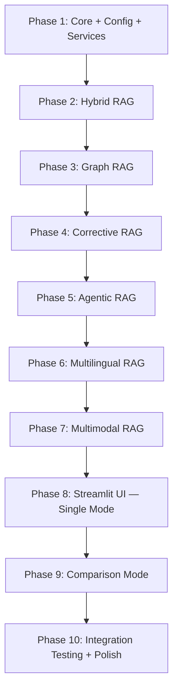

# Multiple RAG System — Finalized Implementation Plan

A unified Python system implementing **6 RAG architectures** in a single, modular application with a Streamlit UI. Users can upload documents (PDF, DOCX, TXT, images), select one or more RAG architectures, query their data, and **compare results side-by-side**.

---

## Decisions Locked In

| Decision | Choice | Notes |
|----------|--------|-------|
| **LLM Provider** | Google Gemini (`google-genai` SDK) | Primary for generation + embeddings. Gemini 2.0 Flash for fast ops, Gemini 2.5 Pro for complex reasoning |
| **GPU** | Available locally | Enables ColPali for Multimodal RAG (primary path) |
| **File Types** | PDF, DOCX, TXT, PNG, JPG, WEBP | Images supported across Multimodal RAG; text extraction for others |
| **Comparison Mode** | Side-by-side | Query 2–6 architectures simultaneously, unified results view |

---

## Reference Architectures

| # | Architecture | Core Idea | Key Differentiator |
|---|-------------|-----------|-------------------|
| 1 | **Hybrid RAG** | Dense vectors + sparse BM25, merged via Reciprocal Rank Fusion | Best general-purpose retrieval accuracy |
| 2 | **Graph RAG** | Knowledge graph with entity extraction, subgraph retrieval, community summaries | Captures relationships standard RAG misses |
| 3 | **Agentic RAG** | Planner agent routes queries to multiple tools, loops until confident | Adaptive multi-step reasoning |
| 4 | **Corrective RAG (CRAG)** | Evaluator grades docs; web search fallback; query rewriting | Self-correcting retrieval |
| 5 | **Multimodal RAG** | Indexes text, images, and tables through ColPali + Gemini Vision | Understands visual content natively |
| 6 | **Multilingual RAG** | Cross-lingual embedding space (BGE-M3) for language-agnostic retrieval | Query in any language, retrieve from any language |

---

## Technology Stack

| Layer | Choice | Rationale |
|-------|--------|-----------|
| **Language** | Python 3.11+ | Standard for ML/AI ecosystem |
| **RAG Framework** | LangChain + LangGraph | Best orchestration for Agentic and CRAG flows |
| **Vector Database** | ChromaDB | Zero-config, persistent storage, metadata filtering |
| **Knowledge Graph** | NetworkX | In-memory, pure Python, no external DB needed |
| **BM25 Search** | `rank_bm25` | Simple, reliable sparse retrieval |
| **Embeddings (English)** | `sentence-transformers` (`all-MiniLM-L6-v2`) | Fast, high-quality, 384-dim |
| **Embeddings (Multilingual)** | `sentence-transformers` (`BAAI/bge-m3`) | Best cross-lingual model, 100+ languages |
| **Multimodal Embeddings** | ColPali (`vidore/colpali-v1.2`) | GPU-accelerated, native document understanding |
| **LLM — Generation** | Gemini 2.5 Flash (`gemini-2.5-flash-preview-05-20`) | Fast, capable, free tier available |
| **LLM — Grading/Routing** | Gemini 2.0 Flash (`gemini-2.0-flash`) | Cheaper, faster for classification tasks |
| **LLM — Vision** | Gemini 2.5 Flash (multimodal) | Image understanding for captioning + QA |
| **Web Search** | DuckDuckGo (free) + Tavily (optional) | No API key required for DDGS |
| **Document Parsing** | `PyPDF2`, `python-docx`, `Pillow`, `pdfplumber` | PDF text + table extraction, DOCX, images |
| **Chunking** | LangChain `RecursiveCharacterTextSplitter` | Proven, configurable |
| **Frontend** | Streamlit | Rich widgets, chat UI, columns for comparison |
| **Config** | Pydantic + `.env` | Type-safe configuration |

---

## Project Structure

```
d:\Multiple RAG System\
├── app.py                          # Streamlit entry point
├── requirements.txt                # All dependencies
├── .env.example                    # API key template
├── .env                            # API keys (gitignored)
├── .gitignore
├── config/
│   ├── __init__.py
│   └── settings.py                 # Pydantic config models
├── core/
│   ├── __init__.py
│   ├── interfaces.py               # Abstract Base Classes (BasePipeline, BaseRetriever)
│   ├── schemas.py                  # Pydantic data models (Document, Chunk, RAGResponse, etc.)
│   └── registry.py                 # Architecture name → pipeline class mapping
├── architectures/
│   ├── __init__.py
│   ├── hybrid/
│   │   ├── __init__.py
│   │   ├── retriever.py            # BM25 + Dense + RRF fusion
│   │   └── pipeline.py             # HybridRAGPipeline
│   ├── graph/
│   │   ├── __init__.py
│   │   ├── extractor.py            # LLM entity/relationship extraction
│   │   ├── graph_store.py          # NetworkX graph management + community detection
│   │   └── pipeline.py             # GraphRAGPipeline
│   ├── agentic/
│   │   ├── __init__.py
│   │   ├── agent.py                # LangGraph planner agent with tool loop
│   │   ├── tools.py                # Vector search, web search, summarize tools
│   │   └── pipeline.py             # AgenticRAGPipeline
│   ├── corrective/
│   │   ├── __init__.py
│   │   ├── grader.py               # LLM document relevance evaluator
│   │   ├── rewriter.py             # Query rewriting logic
│   │   └── pipeline.py             # CorrectiveRAGPipeline
│   ├── multimodal/
│   │   ├── __init__.py
│   │   ├── processor.py            # ColPali embeddings + Gemini Vision captioning
│   │   └── pipeline.py             # MultimodalRAGPipeline
│   └── multilingual/
│       ├── __init__.py
│       ├── embedder.py             # BGE-M3 cross-lingual embeddings + language detection
│       └── pipeline.py             # MultilingualRAGPipeline
├── services/
│   ├── __init__.py
│   ├── vector_store.py             # ChromaDB adapter (per-architecture collections)
│   ├── llm_provider.py             # Gemini adapter (generation, grading, vision)
│   ├── embedding_service.py        # Sentence-transformers adapter (MiniLM + BGE-M3)
│   ├── web_search.py               # DuckDuckGo + Tavily adapter
│   └── document_loader.py          # PDF/DOCX/TXT/Image loader + chunker
├── ui/
│   ├── __init__.py
│   ├── sidebar.py                  # Architecture selector, file upload, settings
│   ├── chat.py                     # Chat interface with streaming
│   ├── comparison.py               # Side-by-side comparison mode
│   └── visualizations.py           # Architecture diagrams, graph viewer, charts
├── data/
│   ├── uploads/                    # Raw uploaded files
│   ├── processed/                  # Chunked data cache
│   └── graphs/                     # Serialized knowledge graphs (JSON)
└── tests/
    ├── __init__.py
    ├── test_hybrid.py
    ├── test_graph.py
    ├── test_corrective.py
    ├── test_services.py
    └── test_comparison.py
```

---

## Proposed Changes

### Component 1: Configuration & Environment

#### [NEW] [.env.example](file:///d:/Multiple%20RAG%20System/.env.example)
Template for required API keys:
```env
GOOGLE_API_KEY=your-gemini-api-key-here
TAVILY_API_KEY=optional-for-enhanced-web-search
```

#### [NEW] [.gitignore](file:///d:/Multiple%20RAG%20System/.gitignore)
Standard Python gitignore + `.env`, `data/uploads/`, `data/processed/`, ChromaDB files.

#### [NEW] [settings.py](file:///d:/Multiple%20RAG%20System/config/settings.py)
Pydantic settings model loading from `.env`:
```python
class Settings(BaseSettings):
    google_api_key: str
    tavily_api_key: str | None = None
    
    # Model configuration
    generation_model: str = "gemini-2.5-flash-preview-05-20"
    grading_model: str = "gemini-2.0-flash"
    embedding_model: str = "all-MiniLM-L6-v2"
    multilingual_model: str = "BAAI/bge-m3"
    
    # Chunking defaults
    chunk_size: int = 1000
    chunk_overlap: int = 200
    
    # Retrieval defaults
    top_k: int = 5
    rrf_k: int = 60  # RRF fusion constant
    
    # ColPali
    use_colpali: bool = True  # GPU available
    colpali_model: str = "vidore/colpali-v1.2"
```

---

### Component 2: Core Framework

#### [NEW] [interfaces.py](file:///d:/Multiple%20RAG%20System/core/interfaces.py)
Abstract base classes all architectures implement:
```python
class BasePipeline(ABC):
    """Every RAG architecture implements this interface."""
    
    @abstractmethod
    async def ingest(self, documents: List[Document]) -> IngestResult:
        """Process and index documents."""
        ...
    
    @abstractmethod
    async def query(self, query: str, top_k: int = 5) -> RAGResponse:
        """Retrieve context and generate an answer."""
        ...
    
    @abstractmethod
    def get_architecture_info(self) -> ArchitectureInfo:
        """Return metadata about this architecture (name, description, flow diagram)."""
        ...
    
    @abstractmethod
    def is_ready(self) -> bool:
        """Whether documents have been ingested and pipeline is queryable."""
        ...
```

#### [NEW] [schemas.py](file:///d:/Multiple%20RAG%20System/core/schemas.py)
Pydantic models shared across all architectures:
- `Document` — raw document with metadata (source filename, type, language, page number)
- `Chunk` — text chunk with embedding vector, source reference, chunk index
- `RetrievalResult` — retrieved chunk + relevance score + retrieval method used
- `RAGResponse` — answer text + list of sources + confidence + architecture name + latency + token count
- `IngestResult` — number of documents/chunks processed, errors
- `ArchitectureInfo` — name, description, mermaid flow diagram string, capabilities list
- `ComparisonResult` — wraps multiple `RAGResponse` objects for side-by-side display

#### [NEW] [registry.py](file:///d:/Multiple%20RAG%20System/core/registry.py)
Maps architecture names to pipeline classes. Used by the UI to instantiate pipelines:
```python
ARCHITECTURE_REGISTRY: Dict[str, Type[BasePipeline]] = {
    "hybrid": HybridRAGPipeline,
    "graph": GraphRAGPipeline,
    "agentic": AgenticRAGPipeline,
    "corrective": CorrectiveRAGPipeline,
    "multimodal": MultimodalRAGPipeline,
    "multilingual": MultilingualRAGPipeline,
}

ARCHITECTURE_METADATA: Dict[str, dict] = {
    "hybrid": {
        "icon": "🔀",
        "name": "Hybrid RAG",
        "tagline": "Dense vectors meet sparse keywords",
        "description": "Combines dense vector similarity with BM25 keyword matching, fused via Reciprocal Rank Fusion for best-of-both-worlds retrieval.",
        "supported_files": ["pdf", "docx", "txt"],
    },
    # ... entries for all 6 architectures
}
```

---

### Component 3: Shared Services

#### [NEW] [llm_provider.py](file:///d:/Multiple%20RAG%20System/services/llm_provider.py)
Google Gemini adapter with multiple model tiers:
- `generate(prompt, context, model_tier="generation")` → str — Main answer generation using Gemini 2.5 Flash
- `grade(prompt, model_tier="grading")` → str — Fast classification using Gemini 2.0 Flash
- `caption_image(image_bytes)` → str — Image description using Gemini Vision
- `extract_entities(text)` → List[Triple] — Structured extraction for Graph RAG
- Handles rate limiting, retries with exponential backoff
- Streaming support via `generate_stream()` for real-time UI updates

#### [NEW] [embedding_service.py](file:///d:/Multiple%20RAG%20System/services/embedding_service.py)
Manages embedding models with lazy loading:
- `EmbeddingService` — default `all-MiniLM-L6-v2` (384-dim, English)
- `MultilingualEmbeddingService` — `BAAI/bge-m3` (1024-dim, 100+ languages), loaded only when multilingual RAG is selected
- `ColPaliEmbeddingService` — `vidore/colpali-v1.2` (GPU), loaded only for multimodal RAG
- Common interface: `embed_texts(texts) → np.ndarray`, `embed_query(query) → np.ndarray`
- Caching: embeddings are cached by content hash to avoid recomputation

#### [NEW] [vector_store.py](file:///d:/Multiple%20RAG%20System/services/vector_store.py)
ChromaDB wrapper with per-architecture collection isolation:
- `get_or_create_collection(architecture_name)` — separate namespace per architecture
- `add_documents(chunks, embeddings, metadatas)`
- `query(query_embedding, top_k, filters)` → List[RetrievalResult]
- `delete_collection(architecture_name)` — clean reset
- `get_collection_stats()` — document/chunk counts for UI display
- Persistent storage in `data/processed/chroma/`

#### [NEW] [document_loader.py](file:///d:/Multiple%20RAG%20System/services/document_loader.py)
Unified document ingestion:
- **PDF**: `PyPDF2` for text extraction + `pdfplumber` for table detection
- **DOCX**: `python-docx` for paragraphs + embedded images
- **TXT**: Direct read with encoding detection
- **Images** (PNG/JPG/WEBP): `Pillow` for loading, passed to Gemini Vision or ColPali
- **Chunking**: `RecursiveCharacterTextSplitter` (configurable size/overlap from settings)
- Returns `List[Document]` with metadata (source, page, content_type)

#### [NEW] [web_search.py](file:///d:/Multiple%20RAG%20System/services/web_search.py)
Web search for Agentic + Corrective RAG fallback:
- `DuckDuckGoSearcher` — free, no API key, uses `duckduckgo-search` library
- `TavilySearcher` — optional, higher quality, requires API key
- Common interface: `search(query, max_results=5) → List[SearchResult]`
- `SearchResult` model: title, url, snippet, relevance_score

---

### Component 4: Hybrid RAG Architecture

#### [NEW] [retriever.py](file:///d:/Multiple%20RAG%20System/architectures/hybrid/retriever.py)
Dual-path retrieval with fusion:
1. **Dense path**: Embed query with MiniLM → ChromaDB cosine similarity → top-K
2. **Sparse path**: BM25 index over raw chunk texts → top-K
3. **Reciprocal Rank Fusion**: `score(d) = Σ 1/(k + rank_dense(d)) + 1/(k + rank_sparse(d))` with k=60
4. Returns merged, re-ranked results with combined scores
- BM25 index is built during ingestion and cached in memory
- Dense + sparse weights are configurable (default 0.5/0.5)

#### [NEW] [pipeline.py](file:///d:/Multiple%20RAG%20System/architectures/hybrid/pipeline.py)
- `ingest()`: Load docs → chunk → embed → store in ChromaDB + build BM25 index
- `query()`: Dual retrieval → RRF fusion → format context → Gemini generates answer
- Architecture flow: `Query → [Dense Search + BM25 Search] → RRF Fusion → Top-K Chunks → LLM → Answer`

---

### Component 5: Graph RAG Architecture

#### [NEW] [extractor.py](file:///d:/Multiple%20RAG%20System/architectures/graph/extractor.py)
LLM-powered entity and relationship extraction:
- Structured prompt instructs Gemini to extract `(entity, type, description)` and `(source, relationship, target)` triples
- Entity types: Person, Organization, Location, Concept, Event, Technology
- Output parsed as JSON for reliability
- Batch processing: extracts from each chunk independently, then merges
- Entity deduplication via fuzzy matching (same entity, different surface forms)

#### [NEW] [graph_store.py](file:///d:/Multiple%20RAG%20System/architectures/graph/graph_store.py)
NetworkX graph management:
- `add_entity(name, type, description)` → node with attributes
- `add_relationship(source, target, relationship_type)` → edge with label
- `get_subgraph(entities, hops=2)` → N-hop neighborhood subgraph
- `detect_communities()` → Louvain/greedy modularity community detection
- `summarize_communities(llm)` → LLM generates a summary for each community
- `serialize() / deserialize()` → JSON persistence to `data/graphs/`
- `to_visualization_data()` → node/edge lists for UI graph viewer

#### [NEW] [pipeline.py](file:///d:/Multiple%20RAG%20System/architectures/graph/pipeline.py)
- `ingest()`: Chunk docs → extract entities/relationships per chunk → build NetworkX graph → detect communities → LLM summarizes each community → also index chunks in ChromaDB for hybrid retrieval
- `query()`: Extract entities from query → retrieve subgraph (2-hop) + relevant community summaries + vector-retrieved chunks → combine context → Gemini generates answer
- Architecture flow: `Query → Entity Extraction → Subgraph Retrieval + Community Summaries → LLM → Answer`

---

### Component 6: Agentic RAG Architecture

#### [NEW] [tools.py](file:///d:/Multiple%20RAG%20System/architectures/agentic/tools.py)
LangChain tool definitions for the agent:
- `vector_search_tool` — semantic search over ingested documents via ChromaDB
- `web_search_tool` — internet search via DuckDuckGo/Tavily
- `summarize_tool` — condenses long retrieved passages
- Each tool returns structured output with source attribution

#### [NEW] [agent.py](file:///d:/Multiple%20RAG%20System/architectures/agentic/agent.py)
LangGraph-based reasoning agent:
- **State**: query, retrieved_docs, plan, iteration_count, is_sufficient
- **Nodes**:
  - `planner` — analyzes query, decides which tools to invoke and in what order
  - `executor` — runs the selected tools in parallel where possible
  - `evaluator` — checks if retrieved information is sufficient to answer
  - `synthesizer` — generates final answer from all gathered context
- **Edges**: planner → executor → evaluator → (if not sufficient, back to planner, max 3 loops) → synthesizer
- Exposes intermediate reasoning steps for UI display ("Agent thinking...")

#### [NEW] [pipeline.py](file:///d:/Multiple%20RAG%20System/architectures/agentic/pipeline.py)
- `ingest()`: Standard chunking + ChromaDB indexing (reuses service layer)
- `query()`: Initialize agent → run LangGraph loop → return final answer + reasoning trace
- Architecture flow: `Query → Planner → [Vector Search / Web Search / Summarize] → Evaluator → (loop?) → Synthesizer → Answer`

---

### Component 7: Corrective RAG (CRAG) Architecture

#### [NEW] [grader.py](file:///d:/Multiple%20RAG%20System/architectures/corrective/grader.py)
LLM-based document relevance evaluator:
- Input: query string + retrieved document text
- Uses Gemini 2.0 Flash (fast, cheap) for grading
- Output: `GradeResult(verdict: "CORRECT" | "INCORRECT" | "AMBIGUOUS", confidence: float, reasoning: str)`
- Grades each retrieved document independently
- Threshold: CORRECT if confidence > 0.7, INCORRECT if < 0.3, else AMBIGUOUS

#### [NEW] [rewriter.py](file:///d:/Multiple%20RAG%20System/architectures/corrective/rewriter.py)
Query transformation for ambiguous results:
- Analyzes the original query + ambiguous results
- Generates a rewritten query that is more specific and targeted
- Uses Gemini Flash for speed

#### [NEW] [pipeline.py](file:///d:/Multiple%20RAG%20System/architectures/corrective/pipeline.py)
Self-correcting retrieval pipeline:
- `ingest()`: Standard chunking + ChromaDB indexing
- `query()` flow:
  1. **Retrieve**: Vector search → top-K documents
  2. **Grade**: Evaluate each document's relevance
  3. **Route** based on grade distribution:
     - **Majority CORRECT** → Filter to correct docs → Gemini generates answer
     - **Majority INCORRECT** → Web search fallback → Gemini generates answer from web results
     - **AMBIGUOUS** → Rewrite query → Re-retrieve → Re-grade → Generate answer
  4. Response includes grade distribution and routing decision for transparency
- Architecture flow: `Query → Retrieve → Grade → [CORRECT→LLM | INCORRECT→Web Search→LLM | AMBIGUOUS→Rewrite→Re-retrieve→LLM] → Answer`

---

### Component 8: Multimodal RAG Architecture

#### [NEW] [processor.py](file:///d:/Multiple%20RAG%20System/architectures/multimodal/processor.py)
Multi-type content processing with **dual approach**:

**Primary (GPU — ColPali)**:
- Uses ColPali model to generate unified embeddings for document pages
- Treats each PDF page as an image → generates multi-vector embeddings
- No separate text extraction needed — the model "reads" the document visually
- Handles text, figures, charts, tables natively in one pass

**Fallback (Gemini Vision captioning)**:
- Extracts text chunks from documents normally
- For images/charts: sends to Gemini Vision API → generates detailed captions
- For tables: extracts via pdfplumber → converts to structured markdown
- Embeds all content (text + captions + table markdown) with standard text embeddings
- Stores original image bytes alongside for display in responses

Config `use_colpali` (from settings) controls which path is used.

#### [NEW] [pipeline.py](file:///d:/Multiple%20RAG%20System/architectures/multimodal/pipeline.py)
- `ingest()`: Parse files → route by content type → process via ColPali or Vision captioning → unified vector index
- `query()`: Embed query → retrieve from unified index → include original images/tables in context → Gemini Vision generates answer referencing visual content
- Architecture flow: `[Text + Images + Tables] → ColPali/Vision Processing → Unified Vector Index → Retrieval → Multimodal LLM → Answer`

---

### Component 9: Multilingual RAG Architecture

#### [NEW] [embedder.py](file:///d:/Multiple%20RAG%20System/architectures/multilingual/embedder.py)
Cross-lingual embedding with BGE-M3:
- Single model handles 100+ languages in a shared vector space
- `embed(texts)` → embeddings where "dog", "perro", "犬" cluster together
- `detect_language(text)` → ISO 639-1 code (using `langdetect` library)
- Language metadata stored alongside chunks for analytics

#### [NEW] [pipeline.py](file:///d:/Multiple%20RAG%20System/architectures/multilingual/pipeline.py)
- `ingest()`: Load docs → detect language → chunk → embed with BGE-M3 → store in ChromaDB with language metadata
- `query()`: Detect query language → embed query with BGE-M3 → retrieve across all languages → Gemini generates answer in the **query's language** (via system prompt)
- Architecture flow: `Query (any language) → BGE-M3 Embedding → Cross-lingual Retrieval → LLM (responds in query language) → Answer`

---

### Component 10: Streamlit UI

#### [NEW] [app.py](file:///d:/Multiple%20RAG%20System/app.py)
Main Streamlit application:
- Page config: wide layout, custom theme (dark mode with accent colors)
- Session state management for: selected architectures, chat history, pipeline instances, ingestion status
- Two modes: **Single Architecture** and **Comparison Mode**
- Routing between chat view and comparison view

#### [NEW] [sidebar.py](file:///d:/Multiple%20RAG%20System/ui/sidebar.py)
Left sidebar with:
- **Mode toggle**: Single / Comparison
- **Architecture selector**:
  - Single mode: radio buttons with icons + taglines (🔀 Hybrid, 🕸️ Graph, 🤖 Agentic, ✅ Corrective, 🖼️ Multimodal, 🌐 Multilingual)
  - Comparison mode: multi-select checkboxes (pick 2–6)
- **File upload**: `st.file_uploader` with multi-file support, accepts PDF/DOCX/TXT/PNG/JPG/WEBP
- **Settings expander**:
  - Chunk size slider (200–2000, default 1000)
  - Chunk overlap slider (0–500, default 200)
  - Top-K slider (1–20, default 5)
- **"Ingest Documents" button**: triggers ingestion with progress bar for selected architecture(s)
- **Collection stats**: shows document/chunk counts per architecture after ingestion

#### [NEW] [chat.py](file:///d:/Multiple%20RAG%20System/ui/chat.py)
Chat interface (single architecture mode):
- `st.chat_message` based conversational UI
- Message history preserved in session state
- Streaming response display via `st.write_stream`
- After each response:
  - **Sources panel**: expandable `st.expander` showing retrieved chunks with relevance scores, source filenames, and page numbers
  - **Metadata**: latency, token count, architecture used
  - **Architecture-specific extras**: knowledge graph subgraph (Graph RAG), reasoning trace (Agentic RAG), grade distribution (CRAG), language distribution (Multilingual)

#### [NEW] [comparison.py](file:///d:/Multiple%20RAG%20System/ui/comparison.py)
Side-by-side comparison mode:
- **Query input**: single text input at the top
- **Results grid**: `st.columns(n)` where n = number of selected architectures (2–6)
- Each column shows:
  - Architecture name + icon
  - Generated answer
  - Response latency
  - Retrieved sources (collapsed)
  - Confidence/relevance scores
- **Comparison metrics bar** at the bottom:
  - Response time comparison (horizontal bar chart)
  - Answer length comparison
  - Source overlap analysis (how many sources are shared across architectures)
- All architectures are queried **concurrently** using `asyncio.gather()` for speed
- Results stream in as each architecture completes (not waiting for all)

#### [NEW] [visualizations.py](file:///d:/Multiple%20RAG%20System/ui/visualizations.py)
Visual components:
- **Architecture flow diagrams**: Mermaid diagrams rendered via `st.markdown` for each architecture's pipeline
- **Knowledge graph viewer**: Interactive graph visualization for Graph RAG using `streamlit-agraph` (nodes = entities, edges = relationships, colored by community)
- **Retrieval score charts**: Horizontal bar chart of retrieved chunks with relevance scores
- **Language distribution**: Pie chart showing language breakdown of retrieved docs (Multilingual RAG)
- **Grade distribution**: Donut chart showing CORRECT/INCORRECT/AMBIGUOUS breakdown (CRAG)
- **Agent reasoning trace**: Step-by-step collapsible timeline (Agentic RAG)

---

## Dependencies (requirements.txt)

```txt
# Core
streamlit>=1.38.0
pydantic>=2.0
pydantic-settings>=2.0
python-dotenv>=1.0

# LLM
google-genai>=1.0

# Embeddings
sentence-transformers>=3.0
torch>=2.0

# Vector Store
chromadb>=0.5.0

# RAG Framework
langchain>=0.3.0
langchain-core>=0.3.0
langchain-community>=0.3.0
langgraph>=0.2.0

# Document Processing
PyPDF2>=3.0
pdfplumber>=0.10
python-docx>=1.0
Pillow>=10.0

# Graph RAG
networkx>=3.0

# Hybrid RAG
rank-bm25>=0.2.2

# Web Search
duckduckgo-search>=6.0

# Multilingual
langdetect>=1.0

# Multimodal (ColPali)
colpali-engine>=0.3.0

# Visualization
streamlit-agraph>=0.0.45
matplotlib>=3.8

# Utilities
numpy>=1.24
```

---

## Implementation Order



| Phase | What | Key Files | Notes |
|-------|------|-----------|-------|
| 1 | Core interfaces, schemas, config, all shared services | `config/`, `core/`, `services/` (9 files) | Foundation — everything depends on this |
| 2 | Hybrid RAG | `architectures/hybrid/` (3 files) | Simplest architecture, validates services work end-to-end |
| 3 | Graph RAG | `architectures/graph/` (4 files) | Entity extraction + NetworkX, highest complexity |
| 4 | Corrective RAG | `architectures/corrective/` (4 files) | Grading + routing, moderate complexity |
| 5 | Agentic RAG | `architectures/agentic/` (4 files) | LangGraph agent loop, moderate-high complexity |
| 6 | Multilingual RAG | `architectures/multilingual/` (3 files) | BGE-M3 integration, straightforward |
| 7 | Multimodal RAG | `architectures/multimodal/` (3 files) | ColPali + Gemini Vision, GPU-dependent |
| 8 | Streamlit UI — Single | `app.py`, `ui/sidebar.py`, `ui/chat.py`, `ui/visualizations.py` | Chat interface for one architecture at a time |
| 9 | Comparison Mode | `ui/comparison.py` + updates to sidebar/app | Side-by-side multi-architecture comparison |
| 10 | Testing + Polish | `tests/`, bug fixes, UX polish | End-to-end validation |

---

## Verification Plan

### Automated Tests
```bash
# Run all tests
python -m pytest tests/ -v

# Test individual components
python -m pytest tests/test_services.py -v     # Shared services
python -m pytest tests/test_hybrid.py -v       # Hybrid RAG
python -m pytest tests/test_graph.py -v        # Graph RAG
python -m pytest tests/test_corrective.py -v   # Corrective RAG
python -m pytest tests/test_comparison.py -v   # Comparison mode
```

### Manual Verification
1. **Upload test documents** (PDF with text + images, TXT, DOCX) → verify ingestion succeeds for each architecture with progress feedback
2. **Query each architecture individually** with the same question → verify answer quality and source attribution
3. **Comparison mode**: Select 3+ architectures → query → verify side-by-side results display correctly with timing metrics
4. **CRAG fallback**: Ask about a topic NOT in uploaded documents → verify web search triggers and is flagged in the response
5. **Agentic reasoning**: Ask a multi-step question → verify agent shows reasoning steps and tool usage
6. **Graph RAG visualization**: After ingestion → verify knowledge graph renders with entities and relationships
7. **Multilingual**: Upload a document in English → query in Spanish → verify answer comes back in Spanish with English sources
8. **Multimodal**: Upload a PDF with charts/images → ask about visual content → verify the model references the images
9. **Architecture switching**: Switch architectures mid-session → verify state isolation (each architecture has its own index)

### Streamlit Smoke Test
```bash
streamlit run app.py
# Verify: sidebar renders, architecture switching works, chat sends/receives,
# file upload works, comparison mode grid renders, visualizations load
```
